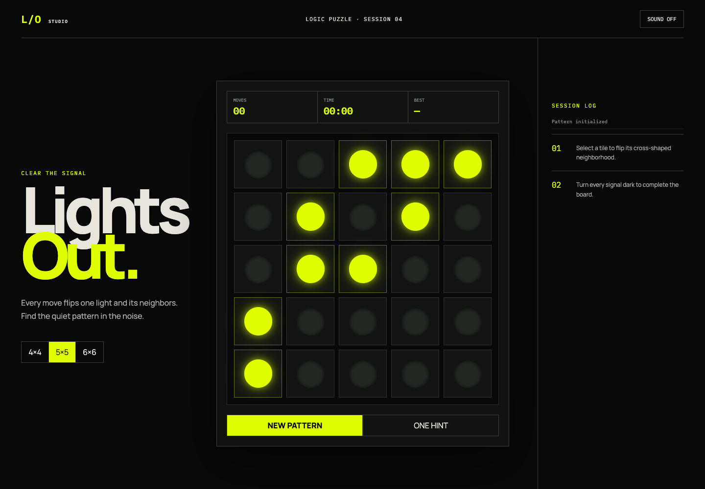

# Lights Out Studio

A tested, accessible strategy puzzle evolved from my original Lights Out coursework project and redesigned as a standalone portfolio application.



## 1. Overview

Turn every signal off. Selecting a tile toggles itself plus its horizontal and vertical neighbors.

## 2. Project lineage

The original version established the playable grid, timer, move counter, restart flow, and win detection. This edition preserves that foundation while replacing the presentation and expanding architecture, tests, difficulty, hints, persistence, and documentation.

[View the original coursework source at the preserved commit.](https://github.com/MacDevil143/ITC505/tree/f415d5006493f46949c7230174be3ecda8730ce2/final)

## 3. Gameplay

Choose a 4×4, 5×5, or 6×6 board, solve it in as few moves as possible, and beat the locally stored best score.

## 4. Solvable generation

Boards are generated by applying legal moves to an all-dark board, so reversing the generated moves always provides at least one solution.

## 5. Architecture

Pure game rules are isolated from DOM and timing behavior. See [ARCHITECTURE.md](docs/ARCHITECTURE.md).

## 6. Interface design

The signal-console visual system uses functional typography, instrument readouts, tactile light states, and a chronological move log. See [GAME_DESIGN.md](docs/GAME_DESIGN.md).

## 7. Accessibility

The board exposes grid cells with coordinates and on/off state, controls are keyboard accessible, and reduced-motion preferences are honored.

## 8. Performance

The app has no runtime dependencies. State changes update a small grid, and animation uses transforms and shadows. Device and browser determine actual refresh rate; no universal FPS claim is made.

## 9. Quick start

```bash
python3 -m http.server 4173
```

## 10. Tests

```bash
node --test tests/*.test.cjs
```

Tests cover center and corner behavior, solved-state detection, and the solvable-board invariant.

## 11. Automated screenshots

```bash
./scripts/capture_screenshots.sh
```

## 12. Repository structure

```text
assets/   rules, controller, visual system
docs/     architecture, game design, interview guide, screenshots
scripts/  repeatable visual captures
tests/    deterministic rule tests
```

## 13. Persistence

Best move counts are stored per board size in localStorage. No personal data leaves the browser.

## 14. Quality automation

GitHub Actions runs the Node test suite for pushes and pull requests with read-only repository permissions.

## 15. Interview walkthrough

Use [INTERVIEW_GUIDE.md](docs/INTERVIEW_GUIDE.md) to discuss the project’s origin, algorithms, trade-offs, and accessibility choices.

## 16. Known boundaries

The sound toggle intentionally communicates visual state only; audio assets are not bundled. The hint is directional, not a full solver.

## 17. Roadmap

- Breadth-first minimal-move solver
- Shareable puzzle seeds
- Optional sound design and haptics
- Automated browser accessibility checks

## 18. License

[MIT](LICENSE)
